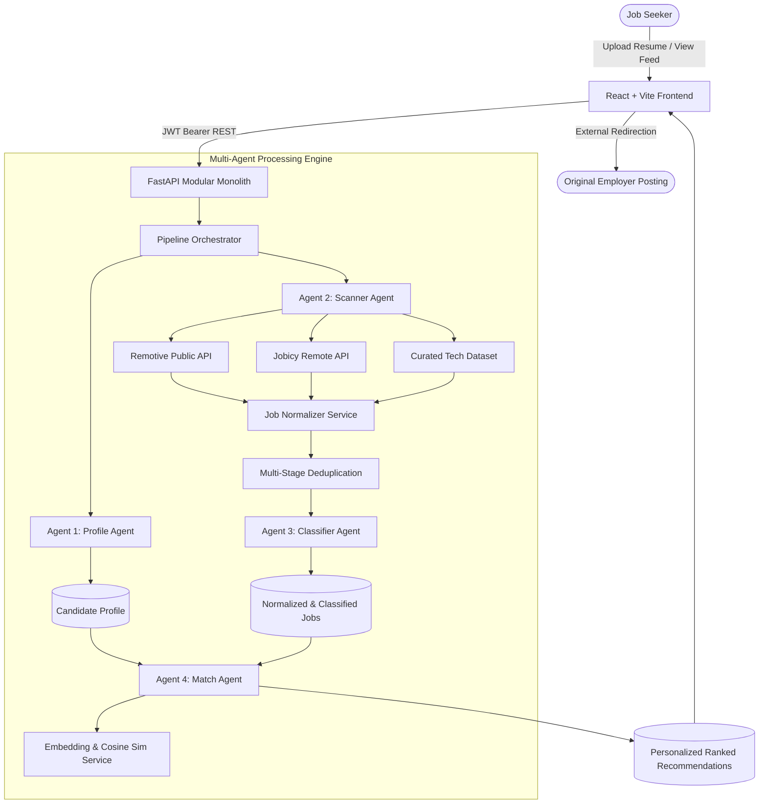

# JobFusion AI

> **"One Resume. Every Opportunity. One Intelligent Career Feed."**
> 
> *Autonomous Multi-Agent Job Discovery, Domain Classification, and Personalized Job Matching Platform.*

---

## Table of Contents
1. [Project Overview](#project-overview)
2. [Problem Statement](#problem-statement)
3. [Key Features](#key-features)
4. [Multi-Agent Architecture](#multi-agent-architecture)
5. [System Architecture Diagram](#system-architecture-diagram)
6. [Deterministic Scoring Engine & Mathematical Formulation](#deterministic-scoring-engine)
7. [Technology Stack](#technology-stack)
8. [Database Design & Collections](#database-design)
9. [Source Adapter Architecture & Compliance](#source-adapters)
10. [API Documentation](#api-documentation)
11. [Environment Setup & Configuration](#environment-setup)
12. [Local Development Guide](#local-development)
13. [Seed Data & Demo Accounts](#seed-data)
14. [Automated Testing](#testing)
15. [Zero-Cost Free-Tier Deployment](#deployment)
16. [Security & Prompt Injection Defense](#security)
17. [Known Limitations & Future Enhancements](#limitations-and-future-enhancements)

---

## 1. Project Overview
**JobFusion AI** is a unified AI-powered career intelligence and personalized job recommendation platform. It solves job-market fragmentation by transforming a candidate's resume into a continuously updated career feed. 

The platform discovers fresh opportunities from permitted external sources, normalizes them into a canonical schema, detects duplicates across multiple job boards, classifies roles across 22 technical and business domains, and matches them to candidate profiles using a 7-dimension scoring engine and semantic vector similarity.

JobFusion AI is **not** a walled-garden job board. It is an intelligent aggregation, personalization, and recommendation layer that redirects candidates to apply on original verified employer postings.

---

## 2. Problem Statement
Job seekers must search across disconnected platforms (LinkedIn, Naukri, Internshala, Indeed, company career portals). Existing portals push listings from their own ecosystem, flood candidates with spam, and conceal matching algorithms behind opaque black-box metrics.

**JobFusion AI solves this fragmentation by:**
- Accepting a candidate's resume (PDF, DOCX, TXT) and building a structured profile.
- Ingesting opportunities from permitted public feeds (Remotive, Jobicy, datasets).
- Deduplicating identical roles posted across multiple job boards.
- Producing transparent, explainable compatibility scores with detailed skill-gap insights.
- Operating on 100% free-tier student infrastructure with local vectorization and zero mandatory paid APIs.

---

## 3. Key Features
- **Intelligent Resume Parsing**: Document text extraction via PyMuPDF and python-docx with skill normalization (e.g. `sklearn` -> `scikit-learn`, `tf` -> `TensorFlow`, `js` -> `JavaScript`).
- **Autonomous Multi-Agent Coordination**: Scanner Agent, Classifier Agent, Profile Agent, Match Agent, and Pipeline Orchestrator.
- **Source Transparency**: Every job clearly displays its verified origin and provides an external "Apply on Source" link.
- **Multi-Stage Deduplication**: Deterministic fingerprinting (SHA-256), URL canonicalization, and token-based similarity.
- **22-Domain Career Taxonomy**: Artificial Intelligence, Machine Learning, Data Science, Frontend, Backend, Full Stack, DevOps, Cloud Computing, Cybersecurity, QA, etc.
- **Explainable Match Scores**: Full score breakdown across Skills (30%), Role (20%), Domain (15%), Experience (15%), Education (10%), Location (5%), and Preferences (5%).
- **Interactive Application Tracker**: Kanban workflow (Saved, Viewed, Applied, Interview, Selected, Rejected) with real-time response rate metrics.
- **Skill Gap Insights**: Highlights high-impact missing requirements across your matching feed with "Why learn this?" guides.
- **Admin Operations Console**: Live agent telemetry, pipeline audit runs, source adapter toggles, and domain distribution analytics.

---

## 4. Multi-Agent Architecture

| Agent | Responsibility | Core Implementation |
|---|---|---|
| **Agent 1: Profile Agent** | Parses resumes, extracts contact, education, experience, normalizes skills, and calculates completeness strength. | `ResumeProfileAgent` (`app/agents/resume_agent.py`) |
| **Agent 2: Scanner Agent** | Discovers opportunities from configured sources, normalizes fields, and detects cross-source duplicates. | `JobDiscoveryAgent` (`app/agents/job_discovery_agent.py`) |
| **Agent 3: Classifier Agent** | Hybrid classification of 22 career domains, experience levels (fresher to senior), and required/preferred skills. | `JobClassificationAgent` (`app/agents/job_classifier_agent.py`) |
| **Agent 4: Match Agent** | Evaluates active jobs against candidate profiles, computes 7-D scores, and generates transparent explanations. | `PersonalizedMatchingAgent` (`app/agents/match_agent.py`) |
| **Pipeline Orchestrator** | Coordinates the entire pipeline sequence idempotently and persists audit records. | `PipelineOrchestrator` (`app/agents/pipeline_orchestrator.py`) |

---

## 5. System Architecture Diagram



---

## 6. Deterministic Scoring Engine

The scoring engine evaluates compatibility using an explicit formula:

$$\text{StructuredScore} = 0.30 \cdot S_{\text{skill}} + 0.20 \cdot S_{\text{role}} + 0.15 \cdot S_{\text{domain}} + 0.15 \cdot S_{\text{experience}} + 0.10 \cdot S_{\text{education}} + 0.05 \cdot S_{\text{location}} + 0.05 \cdot S_{\text{preference}}$$

$$\text{FinalScore} = \text{round}\Big(\big(0.70 \cdot \text{StructuredScore} + 0.30 \cdot \text{SemanticSimilarity}\big) \times 100\Big)$$

### Compatibility Tiers:
- **90–100%**: Excellent Match
- **80–89%**: Strong Match
- **70–79%**: Good Match
- **60–69%**: Moderate Match
- **< 60%**: Low Match

---

## 7. Technology Stack

- **Backend**: Python 3.11, FastAPI, Pydantic v2, Motor (async MongoDB driver), PyMuPDF, python-docx, PyJWT, Bcrypt, Scikit-learn (TF-IDF vectorizer & cosine similarity), HTTPX, Pytest.
- **Frontend**: React 18, Vite 6, Tailwind CSS 3.4, Lucide React icons.
- **Database**: MongoDB Atlas / Local MongoDB 7.0/8.0+.
- **Automation & CI**: GitHub Actions (CI suite and cron job pipeline).

---

## 8. Database Design & Collections

- `users`: Accounts, password hashes, roles (`student`, `admin`).
- `candidate_profiles`: Parsed education, skills, domains, recommended roles, preferences, and profile completeness score.
- `jobs`: Standardized job postings with `fingerprint`, `source`, `domain`, and experience levels.
- `job_sources`: Registered adapter configurations and sync telemetry.
- `matches`: Precomputed personalized recommendations with 7-D breakdowns.
- `saved_jobs`: User bookmarked opportunities.
- `applications`: Kanban application lifecycle tracker (`Saved`, `Viewed`, `Applied`, `Interview`, `Selected`, `Rejected`).
- `pipeline_runs` & `agent_runs`: Audit history and duration logs.

---

## 9. Source Adapter Architecture & Compliance
The platform implements a pluggable `BaseSourceAdapter` interface. No automated bypass of robots.txt, CAPTCHAs, or paywalls is built.
- **Remotive API (`remotive_api`)**: Permitted public REST API for software and tech roles.
- **Jobicy API (`jobicy_api`)**: Permitted public JSON feed for remote roles.
- **Curated Dataset (`curated_dataset`)**: Local verified benchmark dataset for instant testing.

---

## 10. API Documentation
Swagger OpenAPI documentation is automatically available when running the backend at:
`http://localhost:8000/docs`

Key route groups:
- `/api/auth`: Register, login, me, logout.
- `/api/profile`: Get profile, upload resume, update preferences, re-analyze.
- `/api/jobs`: Search, filter, and paginated listing.
- `/api/matches`: Personalized ranked recommendations and score breakdowns.
- `/api/saved`: Save/unsave opportunities.
- `/api/applications`: Kanban status updates and response metrics.
- `/api/skill-gaps`: Career skill demand intelligence.
- `/api/pipeline`: Agent telemetry and execution triggers.
- `/api/admin`: Admin analytics, source toggles, and domain distribution.

---

## 11. Environment Setup & Configuration

Copy `.env.example` to `backend/.env`:
```bash
cp .env.example backend/.env
```

Key environment variables:
```ini
APP_ENV=development
SECRET_KEY=jobfusion-super-secret-development-key-32chars
JWT_SECRET=jobfusion-jwt-secret-token-key-32chars
MONGODB_URI=mongodb://localhost:27017
DATABASE_NAME=jobfusion
FRONTEND_URL=http://localhost:5173
LLM_PROVIDER=local
ADMIN_EMAIL=admin@jobfusion.ai
ADMIN_PASSWORD=AdminPassword123!
```

---

## 12. Local Development Guide

### Prerequisites
- Python 3.11+
- Node.js v18+ / v20+
- MongoDB 7.0+ (Local service or MongoDB Atlas)

### Step 1: Install Backend Dependencies
```bash
cd backend
pip install -r requirements.txt
pip install pydantic-settings
```

### Step 2: Seed Database
```bash
python scripts/seed_data.py
```

### Step 3: Run Backend Server
```bash
uvicorn app.main:app --reload --port 8000
```

### Step 4: Install and Run Frontend
```bash
cd ../frontend
npm install
npm run dev
```
Open `http://localhost:5173` in your browser.

---

## 13. Seed Data & Demo Accounts

For instant evaluation, the platform includes pre-configured demo credentials:

### Demo Candidate Account
- **Email**: `candidate@jobfusion.ai`
- **Password**: `Candidate123!`
- **Profile**: B.Tech AI & Data Science candidate with Python, Pandas, Scikit-learn, TensorFlow, and MongoDB skills.

### Demo Admin Account
- **Email**: `admin@jobfusion.ai`
- **Password**: `AdminPassword123!`
- **Access**: Full platform metrics, source adapter manager, and agent logs.

*(You can also click the one-click demo buttons on the Sign In page for instant access).*

---

## 14. Automated Testing

Run the full pytest suite from the project root:
```bash
python -m pytest -v
```

Includes verification of:
- Authentication & JWT issuance
- Resume parsing & skill normalization
- Multi-stage deduplication & fingerprint generation
- Hybrid domain classification
- **Deterministic Matching Engine Specification Test Case** (Python/TensorFlow/ML candidate vs Docker/AWS job requirements)
- Application lifecycle progression

---

## 15. Zero-Cost Free-Tier Deployment

- **Frontend**: Deploy static bundle (`frontend/dist`) on **Vercel**, **Cloudflare Pages**, or **Netlify**.
- **Backend**: Deploy FastAPI service on **Render** (Free Web Service), **Fly.io**, or **Railway**.
- **Database**: Free M0 cluster on **MongoDB Atlas** (512 MB storage, always free).
- **Scheduled Ingestion**: GitHub Actions workflow (`.github/workflows/job_pipeline.yml`) runs on cron for scheduled background job discovery without paid background workers.

---

## 16. Security & Prompt Injection Defense
- **Data Isolation**: Resume and candidate data are treated purely as **DATA**, never as executable instructions.
- **Bcrypt & JWT**: Industry-standard cryptographic credential handling.
- **RBAC**: Protected routes separate candidates from administrative controls.
- **Non-Degrading Fallback**: The platform functions seamlessly offline or without external LLM keys.

---

## 17. Limitations and Future Enhancements
- **Current Limitations**: Ingestion relies on public APIs and RSS feeds that publish standard JSON; websites that require interactive CAPTCHA or authenticated sessions are not ingested.
- **Future Enhancements**: Integration with authorized university placement feeds, automated resume tailoring tips, and real-time email notification webhooks.

---

## License
MIT License. Built for student and open-source career development.
