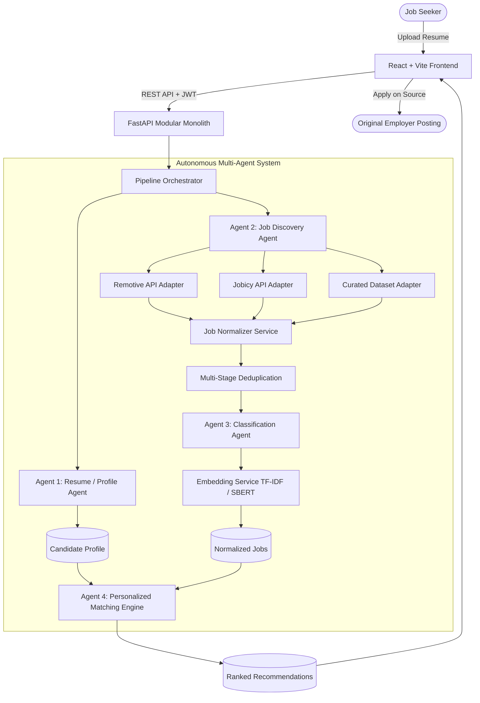

# JobFusion AI — System Architecture

## Overview
JobFusion AI is a unified career intelligence and personalized job recommendation platform. Rather than serving as a walled-garden job portal, it functions as an autonomous aggregation, domain classification, and personalized recommendation layer over permitted external job sources.

## Critical Engineering Principle
- **AI/ML** handles semantic understanding, resume interpretation, skill extraction, domain inference, semantic candidate-job similarity, and recommendation explanation.
- **Deterministic Software** handles authentication, authorization, database operations, validation, deduplication, filtering, sorting, pagination, application tracking, scoring formulas, and security.

## Core Multi-Agent Coordination
1. **Resume / Profile Agent**: Parses PDFs/DOCXs using PyMuPDF and python-docx, extracts normalized technical skills, infers primary and secondary domains, and derives recommended roles.
2. **Job Discovery Agent**: Queries permitted source adapters, standardizes data into the canonical schema, and logs discovery telemetry.
3. **Job Classification Agent**: Employs a hybrid scoring algorithm across 22 technical and business domains, classifies experience level (fresher to senior), location type, and employment type.
4. **Personalized Matching Agent**: Evaluates active opportunities against candidate profiles using a 7-dimension scoring engine and semantic cosine similarity.
5. **Pipeline Orchestrator**: Executes the entire sequence idempotently, recording pipeline runs and agent telemetry for admin observability.
